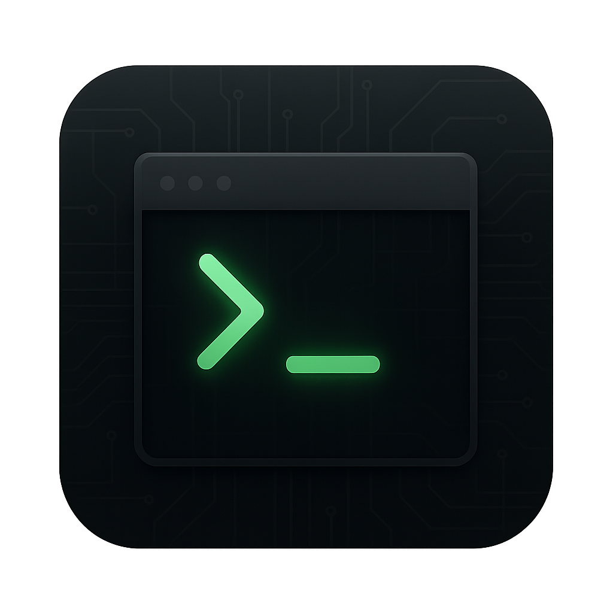

<div align="center">
  
</div>

# Terminal 🚀

A modern, web-based terminal emulator that simulates a complete bash environment with a sleek dark theme. Built with TypeScript, Vite, and modern web technologies.

## ✨ Features

### 📁 Virtual File System
- **Complete file system simulation** with persistent storage
- **Real directory navigation** (cd, pwd, ls)
- **File operations** (touch, mkdir, cat, rm, cp, mv)
- **Persistent data** stored in browser localStorage
- **Realistic file permissions** and timestamps

### ⚡ Advanced Command Processing
- **15+ built-in commands** with proper argument parsing
- **Flag support** (`ls -la`, `rm -rf`, etc.)
- **Command history** with arrow key navigation
- **Tab completion** for commands and files
- **Error handling** with meaningful messages

### 🎯 Developer-Friendly
- **Modular TypeScript architecture** with clean interfaces
- **Extensible command system** - easy to add new commands
- **Type-safe** development with comprehensive interfaces
- **Modern build system** powered by Vite

## 🛠️ Available Commands

### Basic Commands
- `help` - Show available commands
- `clear` - Clear terminal screen
- `echo` - Display text
- `date` - Show current date/time
- `whoami` - Display current user
- `hostname` - Display hostname
- `history` - Show command history

### File System Commands
- `pwd` - Print working directory
- `ls` - List directory contents (supports `-l`, `-a` flags)
- `cd` - Change directory
- `mkdir` - Create directories
- `touch` - Create empty files
- `cat` - Display file contents
- `rm` - Remove files/directories (supports `-r`, `-f` flags)

## 🚀 Getting Started

### Prerequisites
- Node.js (v16 or higher)
- npm or yarn

### Installation
```bash
# Clone the repository
git clone https://github.com/ggenzone/terminal.git
cd terminal

# Install dependencies
npm install

# Start development server
npm run dev
```

### Build for Production
```bash
npm run build
```

## 🏗️ Architecture

The project follows a clean, modular architecture:

```
src/
├── types/
│   └── interfaces.ts          # TypeScript interfaces
├── core/
│   ├── VirtualFileSystem.ts   # File system with persistence
│   ├── Terminal.ts            # Terminal IO and history
│   └── CommandProcessor.ts    # Command parsing and execution
├── commands/
│   ├── BaseCommand.ts         # Base class for all commands
│   ├── BasicCommands.ts       # Basic terminal commands
│   └── FileCommands.ts        # File system commands
└── main.ts                    # Application entry point
```

### Key Components

- **VirtualFileSystem**: Complete file system simulation with localStorage persistence
- **CommandProcessor**: Advanced command parsing with support for flags and arguments
- **TerminalIO**: Handles all input/output operations and user interactions
- **BaseCommand**: Abstract base class that all commands extend
- **Type-safe interfaces**: Comprehensive TypeScript interfaces for all components

## 🎨 Themes

Currently supports a dark terminal theme with:
- Matrix-green text on dark background
- Monospace font (Courier New, Monaco, Menlo)
- macOS-style window controls
- Smooth scrolling and responsive design

## 🔧 Usage Examples

```bash
# Navigate file system
cd Documents
ls -la
mkdir projects
touch readme.txt

# File operations
echo "Hello World" > hello.txt
cat hello.txt
cp hello.txt backup.txt
rm backup.txt

# System information
whoami
hostname
pwd
date
```

## 🤝 Contributing

Contributions are welcome! The modular architecture makes it easy to:

1. **Add new commands**: Extend `BaseCommand` class
2. **Add new themes**: Modify CSS variables
3. **Enhance file system**: Extend `VirtualFileSystem`
4. **Improve UI**: Update terminal components

### Adding a New Command

```typescript
import { BaseCommand } from './BaseCommand.js';
import type { ICommandContext, ICommandResult } from '../types/interfaces.js';

export class MyCommand extends BaseCommand {
  name = 'mycommand';
  description = 'My custom command';
  usage = 'mycommand [options]';

  execute(context: ICommandContext): ICommandResult {
    return this.success(['Command executed successfully!']);
  }
}
```
